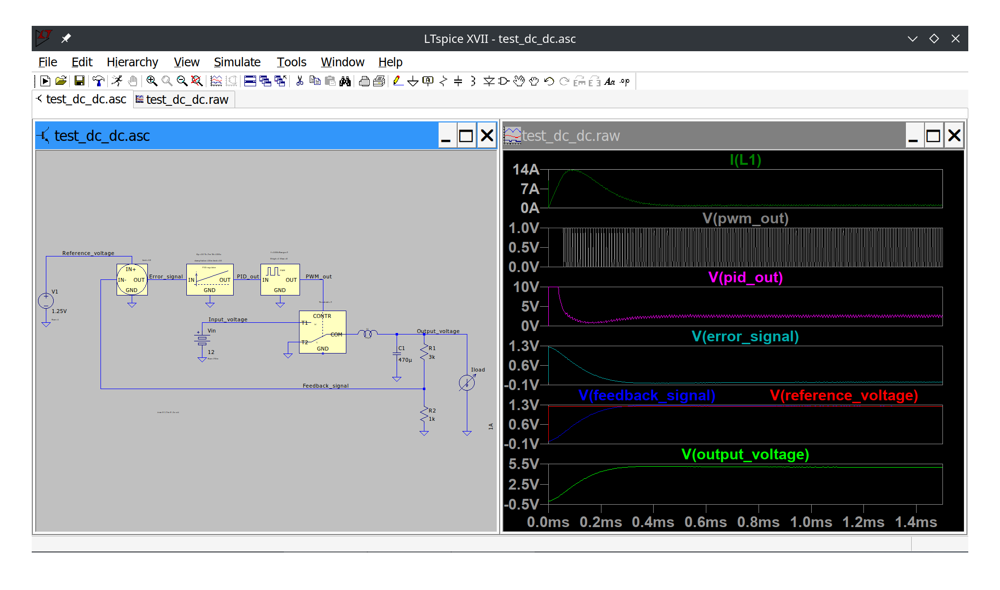

Control library for use with LTSpice:
----------------------------------------------------
This is an addition to the circuit simulation package LTSpice, which gives convenient access to a set of blocks such as PID regulators, 1st order phase lag system, multiplier, PWM modulators, etc.

Features:
---------
- Library consists of text based subcircuit descriptions, file: control.lib
- There is a matching collection of SwitcherCadIII symbol files (extention .asy): control.zip
- Usable in transient calculations and where applicable in linear AC mode
- System blocks implemented with primitive devices (R,C,L) and as much as possible controlled current sources for better convergence
- Parameters can be altered per device instance directly in the schematic
- No need to include a reference to the library, it is already included in the symbols
- Can be used in combination with regular electronic components in LTSpice
- Contains next to the typical control items also PWM modulators and a resistive trimmer

Files included
--------------
- control.lib (this is library defining the behaviour of the circuit blocks)
- control.zip (this archive contains the graphical symbols to use with LTSpice)
- Test_circuit_files.zip (LTSpice circuit files showing some functionality of various blocks)
- Test_circuit_screenshots.zip (screenshots of the circuit files with simulation results)
- README.MD (this read me)
- Test_DC_DC.png (one example screenshot for use in read me)

How to use the control library:
-------------------------------
To use this the library (text file) control.lib must be placed in the directory:
.\LTC\SwCADIII\lib\sub

The symbol files contained in control.zip must be placed in the directory:
.\LTC\SwCADIII\lib\sym\control

(best in the new to be added directory control, so these new blocks do not mix up with the regular components).
Then the symbols are available to be selected amongst the regular components.

Copyright 2025 Nap0
--------------------

This content is free content; you can redistribute it and/or modify
it under the terms of the GNU General Public License as published by
the Free Software Foundation; either version 2 of the License, or
(at your option) any later version.

This content is distributed in the hope that it will be useful,
but WITHOUT ANY WARRANTY; without even the implied warranty of
MERCHANTABILITY or FITNESS FOR A PARTICULAR PURPOSE.  See the
GNU General Public License for more details.

You should have received a copy of the GNU General Public License
along with this program; if not, write to the Free Software
Foundation, Inc., 51 Franklin Street, Fifth Floor, Boston,
MA 02110-1301, USA.
